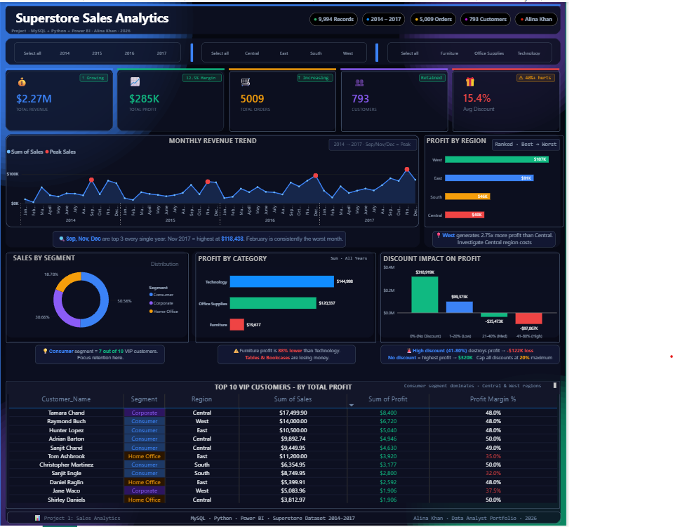
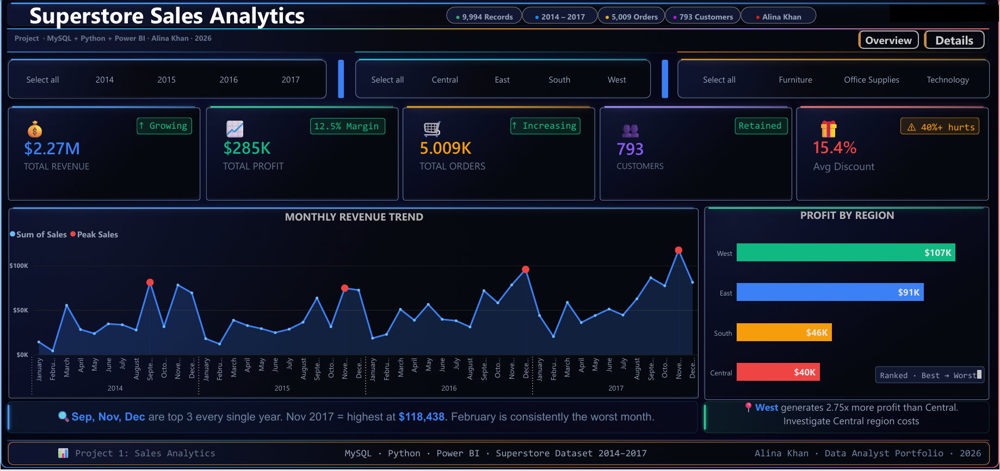
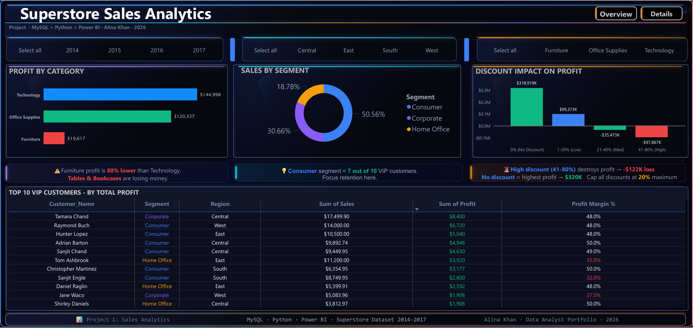

# 📊 Superstore Sales Analytics

### Alina Khan | MySQL · Python · Power BI · Excel | 2026

[](https://linkedin.com/in/alinakhan05)
[](https://github.com/alina2005khann)


---

## 📌 Project Overview

End-to-end data analytics project analyzing 9,994 retail 
transactions using MySQL, Python and Power BI.

**Dataset:** 9,994 records | 2014–2017 | 793 Customers | 
5,009 Orders | 4 Regions | 3 Categories

---

## 📊 Key Metrics

| Metric | Value |
|--------|-------|
| 💰 Total Revenue | $2.27M |
| 📈 Total Profit | $285K |
| 📊 Profit Margin | 12.5% |
| 🛒 Total Orders | 5,009 |
| 👥 Customers | 793 |
| 🎁 Avg Discount | 15.4% |

---

## 📸 Dashboard Preview

### Full Dashboard


### Page 1 — Sales Overview


### Page 2 — Details & Analysis


---

## 🎯 Business Problem

Retail company had no visibility into:
- Which products and categories were profitable vs losing money
- How discounts were destroying profit margins
- Which regions and customers drove the most value
- When peak revenue months occurred for planning

---

## 🔍 Key Business Insights

### 📦 Category Performance
- **Technology** = highest profit at $144,998
- **Office Supplies** = solid at $120,337
- **Furniture** = only $19,617 — major underperformer
- Furniture earns **88% less profit** than Technology
- Tables & Bookcases are **actively losing money**

### 🌍 Regional Performance
- **West** = best region at $107K profit
- **East** = second at $91K
- **South** = $46K, **Central** = only $40K
- West generates **2.75x more profit** than Central

### 📅 Seasonal Trends
- **Sep, Nov, Dec** = top 3 revenue months every year
- **November 2017** = highest ever at $118,438
- **February** = consistently worst month

### 💳 Discount Impact
| Discount Range | Profit Impact |
|---------------|--------------|
| 0% No Discount | +$318,919 |
| 1–20% Low | +$99,373 |
| 21–40% Medium | -$35,473 |
| 41–80% High | -$97,867 |

**40%+ discounts destroyed $122K in profit!**

### 👥 Customer Segments
- **Consumer** = 50.56% of sales (largest)
- **Corporate** = 30.66%
- **Home Office** = 18.78%
- Consumer = **7 out of 10** VIP customers

### 🏆 Top 5 VIP Customers
| Customer | Profit | Margin |
|----------|--------|--------|
| Tamara Chand | $8,400 | 48% |
| Raymond Buch | $6,720 | 48% |
| Hunter Lopez | $5,040 | 48% |
| Adrian Barton | $4,946 | 50% |
| Sanjit Chand | $4,630 | 49% |

---

## 💡 Business Recommendations

1. **Cap all discounts at 20% maximum**
   → 40%+ discounts cause $122K loss
2. **Discontinue Tables & Bookcases**
   → Losing money despite high sales
3. **Maximize marketing in Sep, Nov, Dec**
   → Peak revenue months every year
4. **Retain Consumer segment VIP customers**
   → 7 of top 10 customers are Consumer
5. **Investigate Central region costs**
   → West earns 2.75x more profit

---

## 🛠️ Tools & Techniques

### MySQL — Data Cleaning
| Issue Fixed | Technique Used |
|-------------|----------------|
| Region casing errors | UPDATE + UPPER() |
| Category typos | UPDATE + CASE WHEN |
| NULL values | COALESCE() |
| Duplicate rows | ROW_NUMBER() |
| Negative delivery days | ABS() |
| Date format (VARCHAR→DATE) | STR_TO_DATE() |
| Whitespace in fields | TRIM() |

### MySQL — 8 Business Queries
- Category and Sub-Category profit analysis
- Regional performance comparison
- Monthly revenue trends
- Window functions: RANK() OVER PARTITION BY
- VIP customer identification
- Discount impact analysis
- Shipping mode efficiency
- Year-over-year growth

### Python EDA
- Connected to MySQL via **SQLAlchemy**
- **5 professional visualizations**
- Libraries: Pandas, NumPy, Matplotlib, Seaborn

### Power BI Dashboard
- 2-page interactive dashboard
- Synchronized slicers across pages
- KPI cards with trend indicators
- Insight callout boxes below every chart

---

## 📁 Files

| File | Description |
|------|-------------|
| [superstore_sales.sql](superstore_sales.sql) | MySQL cleaning + 8 business queries |
| [superstore_analysis.ipynb](superstore_analysis.ipynb) | Python EDA notebook |
| [superstore_dashboard.pbix](superstore_dashboard.pbix) | Power BI dashboard file |
| [superstore_raw.csv](superstore_raw.csv) | Raw dataset (9,994 rows) |

---

## 🚀 How to Run

**SQL:**
1. Install MySQL Workbench
2. Open `superstore_sales.sql`
3. Run all queries in order

**Python:**
1. Install libraries:
```
pip install pandas matplotlib seaborn sqlalchemy
```
2. Open `superstore_analysis.ipynb` in Jupyter
3. Run all cells

**Power BI:**
1. Download Power BI Desktop (free)
2. Open `superstore_dashboard.pbix`
3. Use slicers to filter by Year, Region, Category

---

## 👤 About Me

**Alina Khan** — Data Analyst | Delhi, India

I build end-to-end analytics projects using MySQL,
Python and Power BI to extract actionable business
insights from raw data.

📧 alina2005khann@gmail.com
🔗 [LinkedIn](https://linkedin.com/in/alinakhan05)
🔗 [GitHub](https://github.com/alina2005khann)

---

## 🔗 More Projects

| Project | Tools | Link |
|---------|-------|------|
| Mobile Sales Analysis | Power BI · DAX · Power Query | [View](https://github.com/alina2005khann/mobile-sales-analysis) |

---

⭐ If you found this helpful, please give it a star!
